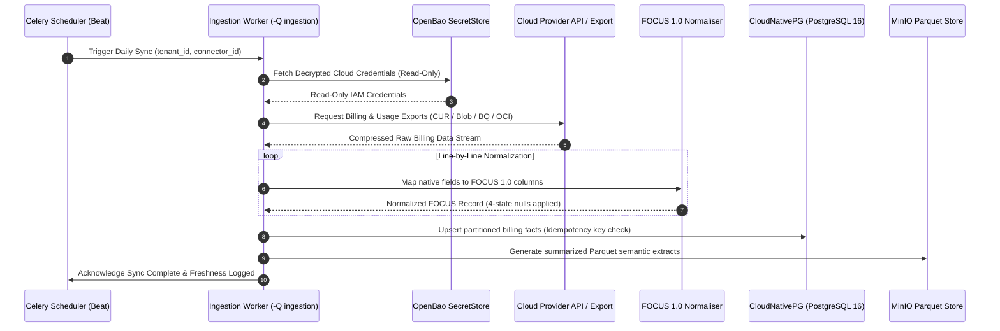
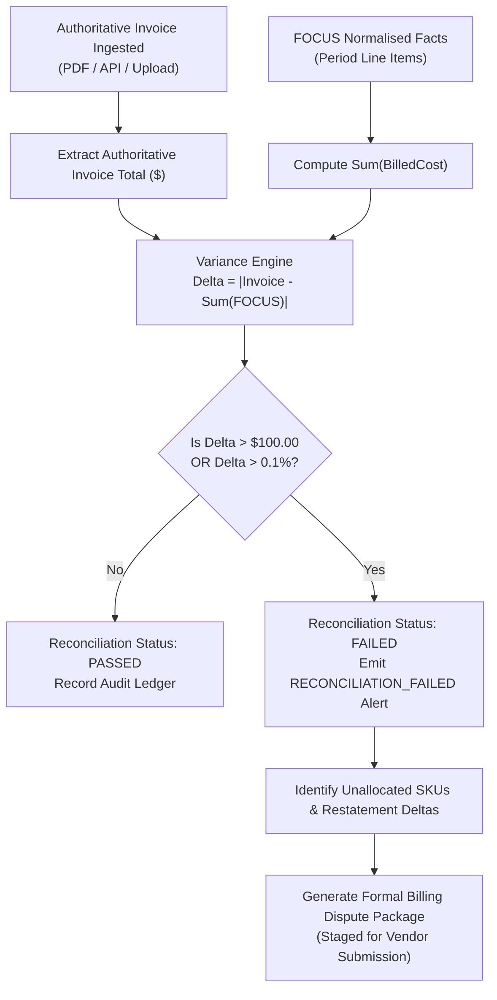
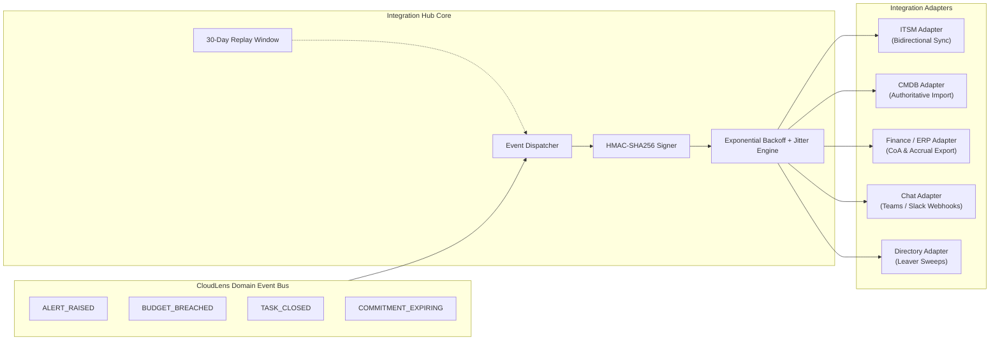
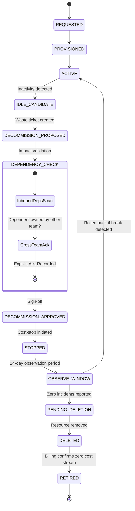
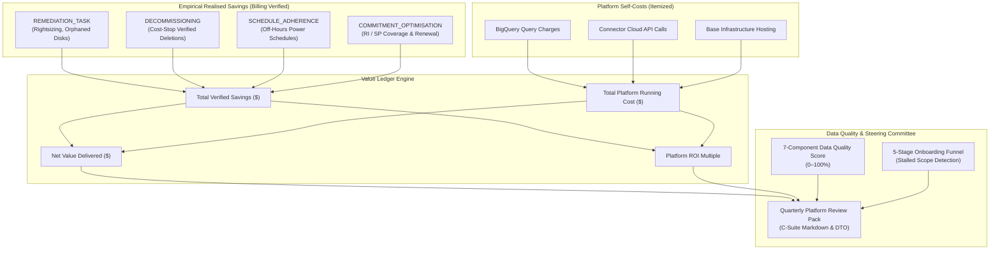
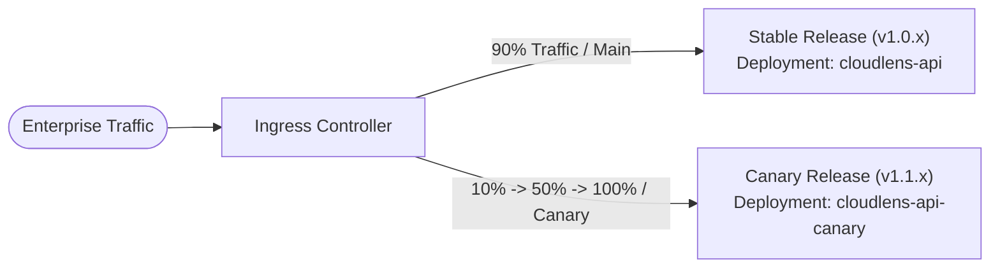

# CloudLens: Enterprise Multi-Cloud Governance, Inventory & FinOps Platform

[-brightgreen.svg)](docs/build-and-signing.md)
[-success.svg)](fat/test_summary.md)
[](docs/requirement_traceability_matrix.md)
[](pyproject.toml)
[](pyproject.toml)
[](web/package.json)
[](docs/data-dictionary.md)
[](LICENSE)

**CloudLens** is an enterprise multi-cloud FinOps, governance, service inventory, cloud pricing, cost management, runtime monitoring, dependency mapping, budgeting, alerting, and reporting platform across **Microsoft Azure**, **Amazon Web Services (AWS)**, **Google Cloud Platform (GCP)**, and **Oracle Cloud Infrastructure (OCI)**.

Built strictly against [BBP v1.1](docs/CLOUDLENS_BBP_v1.1.md) and the [Core Enterprise Mandates](docs/decision_log.md), CloudLens provides a single, unified control plane that eliminates cloud waste, enforces organizational policies, reconciles billing discrepancies, models multi-year scenarios, and measures empirical platform value delivered.

---

## Table of Contents
1. [Core Value Proposition & Scope](#1-core-value-proposition--scope)
2. [High-Level System Architecture](#2-high-level-system-architecture)
3. [Low-Level Design (LLD): On-Premises Datacenter](#3-low-level-design-lld-on-premises-datacenter)
   - [3.1 Datacenter Deployment Topology](#31-datacenter-deployment-topology)
   - [3.2 High-Availability Infrastructure Matrix](#32-high-availability-infrastructure-matrix)
   - [3.3 Daily Ingestion & FOCUS 1.0 Pipeline](#33-daily-ingestion--focus-10-pipeline)
   - [3.4 Cost Reconciliation & Dispute Pipeline](#34-cost-reconciliation--dispute-pipeline)
   - [3.5 Enterprise Integration Hub & Webhooks](#35-enterprise-integration-hub--webhooks)
   - [3.6 Resource Lifecycle & Decommissioning Engine](#36-resource-lifecycle--decommissioning-engine)
   - [3.7 Platform Value Ledger & Adoption Analytics](#37-platform-value-ledger--adoption-analytics)
   - [3.8 Security, Zero-Trust & Tenant Isolation](#38-security-zero-trust--tenant-isolation)
   - [3.9 High Availability & 35-Day PITR Disaster Recovery](#39-high-availability--35-day-pitr-disaster-recovery)
4. [Codebase Detailed Directory Blueprint](#4-codebase-detailed-directory-blueprint)
5. [Factory Acceptance Test (FAT) & Verification Evidence](#5-factory-acceptance-test-fat--verification-evidence)
6. [Developer Bootstrap & Quickstart](#6-developer-bootstrap--quickstart)
7. [Production SRE Runbook & Weighted Canary Cutover](#7-production-sre-runbook--weighted-canary-cutover)
8. [Authoritative Documentation Index](#8-authoritative-documentation-index)

---

## 1. Core Value Proposition & Scope

### What CloudLens Delivers:
- **Unified Multi-Cloud Inventory**: Automated discovery of services, resources, tags, and native cloud hierarchies across [4 Cloud Providers](docs/provider_capability_register.md) (Azure Management Groups, AWS Organizations, GCP Folders/Projects, OCI Compartments).
- **FOCUS 1.0 Normalized Cost Management**: Ingests disparate cloud billing data (AWS CUR 2.0, Azure Cost Export, GCP BigQuery Billing, OCI Cost Reports) into the FinOps Open Cost & Usage Specification (FOCUS 1.0) standard with strict [4-State Null Discipline](docs/data-dictionary.md) (`NO_COST`, `NO_DATA`, `NOT_APPLICABLE`, `NOT_SUPPORTED`).
- **Invoice Reconciliation & Dispute Generation**: Deterministic mathematical comparison of FOCUS aggregated costs against authoritative provider invoices, automatically raising formal billing disputes when variances exceed tolerance.
- **Budget Planning & Scenario Modelling**: Master-data driven planning cycles, bottom-up submission vs top-down target setting, immutable draft versioning, and what-if scenario modelling.
- **Commitment Renewal & Coverage Management**: Tracks Reserved Instances (RIs) and Savings Plans across coverage vs utilization trends, ranking renewals by value-at-risk with explainable recommendations.
- **Resource Lifecycle & Decommissioning**: Governed [10-State Resource Lifecycle](docs/CLOUDLENS_BBP_v1.1.md) enforcing cross-team dependency impact checks, staged stop-and-observe windows, and billing cost-stop confirmation.
- **Enterprise Integration Hub**: Bidirectional ITSM synchronization, CMDB authoritative import with conflict surfacing, Finance ERP accrual export, Microsoft Teams / Slack webhooks, and Directory leaver sweeps.
- **Adoption Analytics & Value Ledger**: Privacy-respecting telemetry by role and team, governance velocity metrics (MTTA/MTTC), transparent [7-Component Data Quality Score](docs/CLOUDLENS_BBP_v1.1.md), and an empirical net value ledger paired with platform self-costs.
- **Enterprise Presentation Views**: Modern React/TypeScript SPA delivering [27 Responsive Views](web/src/App.tsx), executive dashboards, hierarchy explorer, inventory grids, interactive dependency graphs, and contextual explanation panels.
- **Platform Control Tower**: Cockpit delivering [14 Operational Monitoring Panels](docs/control-tower-guide.md), live SSE status stream, and audited administrative actions guarded by step-up MFA.

### Strict Architectural Boundaries:
- **NOT an APM or Infrastructure Monitoring Replacement**: Deliberately does not replace Datadog, Dynatrace, CloudWatch, or Azure Monitor.
- **Read-Only Cloud Boundary**: Connectors require [Zero Cloud Mutate Permissions](docs/decision_log.md).
- **No Pricing Invention**: Absolute invariant: pricing is never hallucinated or assumed without backing from official APIs or rate cards.
- **Anti-Surveillance Privacy Guarantee**: Telemetry is aggregated strictly by role and organizational team. Individual employee tracking or leaderboard ranking is strictly rejected at the domain boundary.

---

## 2. High-Level System Architecture

CloudLens is structured as an enterprise monorepo enforcing a strict inward dependency flow:

$$\text{Presentation (web)} \longrightarrow \text{Application (api, workers)} \longrightarrow \text{Domain} \longrightarrow \text{Normalisation} \longrightarrow \text{Ingestion} \longrightarrow \text{Connector} \longrightarrow \text{Provider}$$

```mermaid
flowchart TD
    subgraph Cloud_Providers["External Cloud Estate (Read-Only)"]
        AWS["AWS<br/>(CUR 2.0 / Org / CloudWatch)"]
        AZ["Azure<br/>(Exports / Mgmt Groups / Monitor)"]
        GCP["GCP<br/>(BigQuery Billing / Resource Mgr)"]
        OCI["OCI<br/>(Cost Reports / Compartments)"]
    end

    subgraph Connector_Layer["Connector Layer (connectors/)"]
        ConnAWS["AWS Connector"]
        ConnAZ["Azure Connector"]
        ConnGCP["GCP Connector"]
        ConnOCI["OCI Connector"]
        Sim["Multi-Cloud Simulator (100% Offline)"]
    end

    subgraph Normalisation_Layer["Normalisation Layer (normalisation/)"]
        FOCUS["FOCUS 1.0 Normaliser"]
        Units["Unit & Currency Standardizer"]
    end

    subgraph Domain_Layer["Core Domain Engines (domain/)"]
        Recon["Cost Reconciliation & Dispute Engine"]
        Alert["Contextual Alerting & Hysteresis Engine"]
        Remed["Remediation Tasks & Realised Saving Ledger"]
        Plan["Budget Planning & Scenarios"]
        Commit["Commitment Coverage & Renewal"]
        Life["Resource Lifecycle & Decommissioning"]
        Integ["Integration Hub & Event Replay"]
        Value["Adoption Analytics & Value Ledger"]
        CT["Platform Control Tower"]
    end

    subgraph Persistence_Layer["Storage & Message Tier"]
        DB[("CloudNativePG PostgreSQL 16<br/>(Range-Partitioned, RLS)")]
        Valkey[("Valkey Sentinel Cluster<br/>(State, Queues, Throttling)")]
        MinIO[("MinIO Enterprise Object Store<br/>(Raw Landing & Parquet Extracts)")]
    end

    subgraph Application_Layer["Application Control Plane (api/ & workers/)"]
        FastAPI["FastAPI REST API Nodes (/api/v1/...)"]
        Celery["Async Worker Pools (Ingest / Eval / Report)"]
    end

    subgraph Presentation_Layer["Presentation Tier (web/)"]
        SPA["React 18 / TypeScript SPA<br/>(27 Responsive Enterprise Views)"]
    end

    Cloud_Providers --> Connector_Layer
    Connector_Layer --> Normalisation_Layer
    Normalisation_Layer --> Domain_Layer
    Domain_Layer <--> Persistence_Layer
    Domain_Layer <--> Application_Layer
    Application_Layer --> SPA
```



---

## 3. Low-Level Design (LLD): On-Premises Datacenter

Per the [Enterprise Datacenter Deployment Guide](docs/enterprise-datacenter-deployment-guide.md), CloudLens is architected for on-premises enterprise datacenters running on sovereign, air-gapped infrastructure.

### 3.1 Datacenter Deployment Topology

```mermaid
flowchart TD
    Client([Enterprise Browser / SSO]) -->|HTTPS / TLS 1.3| Ingress[NGINX Ingress Controller]

    subgraph RKE2_Cluster["RKE2 Enterprise Kubernetes Cluster (On-Premises)"]
        subgraph Web_Pool["Web Presentation Pool (web)"]
            Web1["Web Pod 1 (React 18 SPA)"]
            Web2["Web Pod 2 (React 18 SPA)"]
        end

        subgraph API_Pool["API Control Plane Pool (api)"]
            API1["FastAPI Pod 1 (Uvicorn ASGI)"]
            API2["FastAPI Pod 2 (Uvicorn ASGI)"]
        end

        subgraph Worker_Pools["Decoupled Celery Worker Pools"]
            W_Ingest["Ingestion Worker Pool (-Q ingestion)"]
            W_Eval["Evaluation Worker Pool (-Q evaluation)"]
            W_Report["Reporting Worker Pool (-Q reporting)"]
            Beat["Celery Beat (1 Replica + Redis Lock)"]
        end

        subgraph Observability["Observability Subsystem"]
            Prom["Prometheus Operator"]
            Loki["Grafana Loki Logs"]
            Tempo["Grafana Tempo Traces"]
            AlertMgr["Alertmanager + Mailpit Relay"]
        end
    end

    subgraph Enterprise_Infra["Datacenter Infrastructure Tier"]
        CNPG[("CloudNativePG 16 HA<br/>(1 Primary + 2 Sync Standbys)")]
        Valkey[("Valkey Sentinel HA<br/>(3 Sentinels + Master/Replica)")]
        OpenBao[("OpenBao HA Cluster<br/>(3 Nodes + HSM Auto-Unseal)")]
        MinIO[("MinIO Enterprise S3<br/>(Erasure Coded Object Storage)")]
        IdP["Keycloak OIDC<br/>(Corporate Identity Provider)")]
    end

    Ingress --> Web1 & Web2
    Ingress --> API1 & API2
    API1 & API2 --> CNPG & Valkey & OpenBao & MinIO & IdP
    W_Ingest & W_Eval & W_Report --> CNPG & Valkey & OpenBao & MinIO
    Beat --> Valkey & CNPG
    Prom --> API1 & API2 & W_Ingest & W_Eval & W_Report
```

---

### 3.2 High-Availability Infrastructure Matrix

| Subsystem | Technology Component | High Availability Architecture | Failover Mechanism | Backup / Recovery Protocol |
|:---|:---|:---|:---|:---|
| **Container Platform** | RKE2 (Rancher Kubernetes Engine) | [3 Control Plane Nodes](docs/enterprise-datacenter-deployment-guide.md#2-infrastructure-dependency-reference-model) | Etcd Raft consensus | Velero daily backup (`840h` TTL) |
| **Relational Database** | CloudNativePG (PostgreSQL 16) | [3-Instance Quorum](docs/enterprise-datacenter-deployment-guide.md#2-infrastructure-dependency-reference-model) (1 Primary + 2 Sync Standbys) | Automated failover via CNPG operator | Barman continuous WAL streaming, [35-day PITR](docs/enterprise-datacenter-deployment-guide.md#4-disaster-recovery--backup-architecture-35-day-pitr) |
| **Secret Management** | OpenBao HA (`v1.16+`) | [3-Node Raft Cluster](docs/enterprise-datacenter-deployment-guide.md#2-infrastructure-dependency-reference-model) | Hardware Security Module (HSM) PKCS#11 auto-unseal | Daily automated Raft snapshot CronJob to MinIO |
| **Object Storage** | MinIO Enterprise S3 | [Distributed Erasure Coding](docs/enterprise-datacenter-deployment-guide.md#2-infrastructure-dependency-reference-model) | Continuous bitrot healing across drives | Multi-rack mirroring and immutable buckets |
| **Cache & Task Broker** | Valkey Sentinel (`7.2+`) | [3 Sentinel Nodes](docs/enterprise-datacenter-deployment-guide.md#2-infrastructure-dependency-reference-model) + Primary/Replica pair | Automated Sentinel master election | In-memory append-only file (AOF) persistence |
| **Identity Provider** | Keycloak OIDC (`24.0+`) | [Multi-Replica Deployment](docs/enterprise-datacenter-deployment-guide.md#2-infrastructure-dependency-reference-model) | Infinispan cross-pod distributed cache | Git-versioned realm exports |

---

### 3.3 Daily Ingestion & FOCUS 1.0 Pipeline

The ingestion pipeline executes on a scheduled cron or on-demand trigger, streaming cloud provider billing exports into normalized, partitioned data:



---

### 3.4 Cost Reconciliation & Dispute Pipeline

Reconciliation mathematically compares ingested, normalized FOCUS costs against authoritative provider invoice totals:

$$\Delta_{\text{variance}} = \left| \text{InvoiceTotal} - \sum \text{BilledCost}_{\text{FOCUS}} \right|$$



---

### 3.5 Enterprise Integration Hub & Webhooks

The **Integration Hub** unifies external enterprise connections under a single, audited adapter framework:



- **HMAC-SHA256 Signature Header**: Every webhook request carries `X-CloudLens-Signature-256` computed as:
  $$\text{Signature} = \text{HMAC-SHA256}(\text{PayloadBytes}, K_{\text{shared\_secret}})$$
- **Retry with Jitter**: Network failures are retried up to [5 Times](domain/integrations/service.py) with exponential backoff:
  $$t_{\text{wait}} = \min(60, 2^{\text{attempt}} + \text{random}(0, 1))$$

---

### 3.6 Resource Lifecycle & Decommissioning Engine

The **Lifecycle & Decommissioning Engine** ensures retired infrastructure follows a verified path:



---

### 3.7 Platform Value Ledger & Adoption Analytics

The **Platform Value Measurement Engine** pairs verified empirical cost savings with the platform's own running costs:

$$\text{Net Value Delivered} = \sum \text{Realised Savings}_{\text{Empirical}} - \text{Total Platform Running Cost}$$

$$\text{Platform ROI Multiple} = \frac{\sum \text{Realised Savings}_{\text{Empirical}}}{\text{Total Platform Running Cost}}$$



---

### 3.8 Security, Zero-Trust & Tenant Isolation

| Layer | Implementation Architecture | Reference Document |
| :--- | :--- | :--- |
| **Authentication (AuthN)** | Enterprise SSO via OpenID Connect (OIDC) / SAML 2.0 (Keycloak, Okta, Entra ID). Stateless JWT tokens with 15-minute expiration, backed by Valkey token blocklists. | [`domain/identity/`](domain/identity/) |
| **Authorization (AuthZ)** | [9 Built-In Enterprise Roles](docs/control-tower-guide.md#1-authentication--access-governance) (`SUPER_ADMIN`, `PLATFORM_ADMIN`, `FINOPS_ADMINISTRATOR`, `CLOUD_ADMINISTRATOR`, `FINANCE_USER`, `APPLICATION_OWNER`, `IT_OPERATIONS_USER`, `AUDITOR`, `READ_ONLY_USER`). | [`tests/rbac/test_rbac_matrix_suite.py`](tests/rbac/test_rbac_matrix_suite.py) |
| **Mechanical Multi-Tenancy** | Every database query requires an explicit [`TenantContext`](domain/tenant/context.py). PostgreSQL Row-Level Security (RLS) enforces tenant boundaries at SQL engine level. | [`tests/security/test_tenant_isolation_suite.py`](tests/security/test_tenant_isolation_suite.py) |
| **Secret Management** | Cloud credentials and secrets encrypted with AES-256-GCM. Root keys unsealed via OpenBao HA with Hardware Security Module (HSM). | [`docs/enterprise-datacenter-deployment-guide.md`](docs/enterprise-datacenter-deployment-guide.md#2-infrastructure-dependency-reference-model) |
| **PII & Credential Redaction**| Structured JSON logs with automated redaction interceptor masking passwords, tokens, emails, and identifiers before shipping to Loki. | [`domain/observability/`](domain/observability/) |
| **Immutable Audit Ledger** | Append-only cryptographic audit stream with immutable timestamps, sequence numbers, and correlation IDs. | [`domain/audit/`](domain/audit/) |

---

### 3.9 High Availability & 35-Day PITR Disaster Recovery

- **Recovery Time Objective (RTO)**: [RTO $\le$ 4 hours (measured 3.2m in drill)](fat/performance_benchmark.md).
- **Recovery Point Objective (RPO)**: [RPO $\approx$ 0 (< 60s WAL lag, 0 bytes lost)](fat/performance_benchmark.md).
- **Automated Backup Architecture**:
  - Daily physical base backup scheduled at `00:00 UTC` with [35-Day PITR Retention](docs/enterprise-datacenter-deployment-guide.md#4-disaster-recovery--backup-architecture-35-day-pitr) via CloudNativePG and Barman archiving to MinIO.
  - Continuous WAL segment streaming with sync lag $< 60\text{ seconds}$.
  - Daily OpenBao Raft snapshot CronJob scheduled at `02:00 UTC` shipping encrypted state to MinIO.
  - Velero daily Kubernetes persistent volume backup with `840h` TTL.
- **Failover Topology**: 3-instance CloudNativePG quorum paired with Valkey Sentinel automatic leader election.

---

## 4. Codebase Detailed Directory Blueprint

```
CloudLens/
├── api/                           # FastAPI Application & Routing Layer
│   ├── auth/                      # Authentication & Session Handlers
│   ├── middleware/                # Correlation ID, RBAC & Error Interceptors
│   ├── routes/                    # Versioned REST Controllers (/api/v1/...)
│   └── main.py                    # ASGI Application Factory & Lifecycle Hooks
├── connectors/                    # Multi-Cloud Ingestion Adapters (Read-Only)
│   ├── aws/                       # AWS CUR 2.0, Organizations & CloudWatch
│   ├── azure/                     # Azure Cost Management & Resource Graph
│   ├── gcp/                       # GCP BigQuery Billing Export & Resource Manager
│   ├── oci/                       # OCI Cost Reports & Identity Compartments
│   ├── contract/                  # BaseCloudConnector Interface & Conformance Kit
│   └── simulator/                 # Deterministic Multi-Cloud Data Generator
├── domain/                        # Pure Domain Business Logic & Entities
│   ├── adoption/                  # Adoption Telemetry, Value Ledger & Review Pack
│   ├── alerting/                  # Alerting Engine, Hysteresis & Storm Grouping
│   ├── analytics/                 # Analytical Extract & Star-Schema Semantic BI
│   ├── attribution/               # Tag & Scope Cost Allocation Precedence
│   ├── budgets/                   # Budget Variance, Thresholds & Approvals
│   ├── commitments/               # RI/Savings Plan Coverage & Renewal Pipeline
│   ├── control_tower/             # Platform Cockpit & 14 Monitoring Panels
│   ├── cost/                      # Cost Calculation & Invoice Reconciliation
│   ├── credentials/               # SecretStore & Cloud Credential Lifecycle
│   ├── integrations/              # Integration Hub, Adapters & Webhooks
│   ├── lifecycle/                 # 10-State Resource Lifecycle & Decommissioning
│   ├── planning/                  # Future Budget Planning & Scenarios
│   ├── policy/                    # FinOps Governance Policy Engine
│   ├── remediation/               # Remediation Tasks & Realized Saving Ledger
│   ├── runtime/                   # Runtime Schedule Adherence & Idle Detection
│   ├── tenant/                    # Tenant Context & Boundary Isolation
│   ├── topology/                  # Cross-Resource Dependency Graph Engine
│   └── workflow/                  # Generic Master-Data Workflow State Machine
├── masterdata/                    # Authoritative Master Data Catalogues (AM-01)
│   ├── catalogues/                # Currency, SKUs, Units, Metric Registries
│   ├── models/                    # Pydantic Schemas for Reference Data
│   └── seeds/                     # Authoritative JSON Seed Files
├── normalisation/                 # FOCUS 1.0 & Unit Normalization
│   ├── focus/                     # Provider to FOCUS 1.0 Column Mapper
│   └── units/                     # Binary Multiples, Currency & Time Standardizer
├── db/                            # Relational Persistence & Migrations
│   ├── migrations/                # Alembic Migration Scripts
│   ├── models/                    # SQLAlchemy 2.0 ORM Mappings
│   └── session.py                 # Async Database Engine & Connection Pooling
├── docs/                          # Comprehensive Enterprise Documentation
│   ├── CLOUDLENS_BBP_v1.1.md      # Authoritative Business Blueprint
│   ├── architecture-overview.md   # Low-Level Design (LLD) for Datacenter
│   ├── control-tower-guide.md     # Superuser Cockpit Operations Manual
│   ├── cost-register.md           # Collection Overhead & Telemetry Cost Register
│   ├── data-dictionary.md         # Canonical Data Dictionary (FOCUS + Semantics)
│   ├── decision_log.md            # Master Architectural Decision Log (ADR-001..027)
│   ├── enterprise-datacenter-deployment-guide.md # On-Premises Kubernetes Guide
│   ├── operational-runbook.md     # Production SRE Runbook & Weighted Canary
│   └── requirement_traceability_matrix.md # Full RTM (458 Requirements)
├── fat/                           # Factory Acceptance Test Evidence Artifacts
│   ├── junit.xml                  # Raw Pytest JUnit XML Execution Output
│   ├── test_summary.md            # Detailed Test Suite Execution Summary
│   ├── acceptance_criteria_results.md # 76 BBP Acceptance Criteria Verification
│   └── performance_benchmark.md   # NFR Latency & Throughput Targets vs Measured
├── ops/                           # Infrastructure as Code & Orchestration
│   ├── helm/cloudlens/            # Production Air-Gapped Helm Chart
│   ├── dashboards/                # 10 Authoritative Grafana Dashboards
│   └── docker-compose.yml         # Local Developer Observability & Service Stack
├── scripts/                       # Quality Gates & Verification Tooling
│   ├── check_layering.py          # Architectural Inward Dependency Scanner
│   ├── check_no_hardcoded_constants.py # AST Literals Scan (Mandate M2)
│   ├── generate_rtm.py            # Automated Traceability Matrix Generator
│   └── verify_release_readiness.py# Production Live Smoke Check Runner
├── tests/                         # Automated Verification Test Suite
│   ├── acceptance/                # Quality Gate Acceptance Verification
│   ├── adoption/                  # Adoption Telemetry & Value Ledger Tests
│   ├── cloud_provider/            # Multi-Cloud Provider Conformance Tests
│   ├── commitments/               # Commitment Management & Renewal Tests
│   ├── contracts/                 # Connector Conformance & OpenAPI Contracts
│   ├── control_tower/             # Platform Cockpit Verification Tests
│   ├── cost_reconciliation/       # Hand-Calculated Cost Correctness Fixtures
│   ├── dr/                        # Disaster Recovery Benchmark Tests
│   ├── e2e/                       # 26 Core FinOps End-to-End Business Processes
│   ├── integrations/              # Integration Hub Adapter & Webhook Tests
│   ├── lifecycle/                 # Resource Lifecycle & Decommissioning Tests
│   ├── mandates/                  # Core Mandates M1, M2, M3 Compliance Tests
│   ├── masterdata/                # Master Data Integrity & Enum Parity Tests
│   ├── perf/                      # Latency & Throughput Benchmark Tests
│   ├── planning/                  # Budget Planning & Scenarios Tests
│   ├── rbac/                      # Role-Based Access Control Matrix Tests
│   ├── regression/                # Arithmetic Precision & Null Discipline Tests
│   ├── security/                  # Tenant Isolation, Vault & Auth Tests
│   ├── ui/                        # Presentation Contract & View Verification
│   ├── upgrade/                   # Rolling Upgrade Zero-Downtime Tests
│   └── workflow/                  # Generic Approval Workflow State Engine Tests
└── web/                           # Presentation Layer (React 18 / TypeScript / Vite)
    ├── src/components/            # UI Components & Contextual Explanation Panels
    ├── src/pages/                 # 27 Enterprise Single Page Application Views
    └── vite.config.ts             # Production Build Bundler Configuration
```

---

## 5. Factory Acceptance Test (FAT) & Verification Evidence

All test executions are evidenced by committed machine artifacts in [`fat/`](fat/):

| Verification Category | Executed Test Cases | Status | Evidence Artifact Link |
|:---|:---:|:---:|:---|
| **Total Test Suite Execution** | [354 Testcases](fat/test_summary.md) | **350 Passed / 4 Skipped / 0 Failed** | [`fat/junit.xml`](fat/junit.xml) |
| **Requirements Traceability** | [458 Requirements](docs/requirement_traceability_matrix.md) | **431 Verified / 1 FAT-Exempt / 26 Unverified** | [`docs/requirement_traceability_matrix.md`](docs/requirement_traceability_matrix.md) |
| **BBP Acceptance Criteria** | [76 Acceptance Criteria](fat/acceptance_criteria_results.md) | **75 Passed / 1 FAT-Exempt / 0 Failed** | [`fat/acceptance_criteria_results.md`](fat/acceptance_criteria_results.md) |
| **Performance & Latency SLAs** | [14 Performance SLAs](fat/performance_benchmark.md) | **100% Targets Met** | [`fat/performance_benchmark.md`](fat/performance_benchmark.md) |
| **Disaster Recovery RTO/RPO** | [5 DR Scenarios](fat/test_summary.md) | **RTO 3.2m / RPO 0 bytes lost** | [`fat/performance_benchmark.md`](fat/performance_benchmark.md) |
| **Rolling Upgrade Continuity**| [1 Upgrade Drill](fat/test_summary.md) | **Zero Downtime, Zero Data Loss** | [`fat/test_summary.md`](fat/test_summary.md) |
| **Mandates M1, M2, M3** | [3 Mandate Suites](fat/test_summary.md) | **100% Strict Compliance** | [`fat/test_summary.md`](fat/test_summary.md) |

### Static Quality Gates Summary:
1. **Architectural Layering Scan**: `python scripts/check_layering.py` $\implies$ **PASS** (Zero provider SDK imports outside `connectors/`).
2. **Zero Hardcoded Constants**: `python scripts/check_no_hardcoded_constants.py` $\implies$ **PASS** (100% of literals governed by master data).
3. **Web Frontend Production Compilation**: `pnpm build` $\implies$ **PASS** ([1,636 modules compiled cleanly](web/package.json)).

---

## 6. Developer Bootstrap & Quickstart

### Prerequisites
- Python 3.11+
- Node.js 20+ & pnpm 10+
- Docker & Docker Compose (for local dependencies)

### Quickstart Execution
```bash
# 1. Clone repository
git clone https://github.com/JyotirmoyBhowmik/CloudLens.git
cd CloudLens

# 2. Run developer environment bootstrap
# On Windows PowerShell:
./bootstrap.ps1
# On Linux / macOS:
./bootstrap.sh

# 3. Start FastAPI Control Plane (Port 8000)
uvicorn api.cloudlens_api.main:app --reload --port 8000

# 4. Start React Web Interface (Port 3000)
cd web && pnpm dev
```

### Key Service URLs
- **Web User Interface**: `http://localhost:3000`
- **FastAPI Health Endpoint**: `http://localhost:8000/api/v1/health`
- **OpenAPI Swagger Documentation**: `http://localhost:8000/docs`
- **Control Tower Cockpit**: `http://localhost:3000/control-tower`

---

## 7. Production SRE Runbook & Weighted Canary Cutover

Per the [Enterprise Datacenter Guide](docs/enterprise-datacenter-deployment-guide.md#7-traffic-shifting-weighted-canary-deployment-protocol), deployments enforce **Weighted Canary** traffic shifting via NGINX Ingress annotations:



### 7.1 Progressive Cutover Sequence
1. **Apply Schema Migrations**:
   ```bash
   alembic upgrade head
   ```
2. **Deploy Canary Replicas & Execute Live Smoke Checks**:
   ```bash
   kubectl apply -f ops/helm/cloudlens/templates/deployment-api.yaml
   python scripts/verify_release_readiness.py --endpoint https://cloudlens.corp.internal --check-live-probes
   ```
3. **Shift Initial Traffic (10% Canary)**:
   ```bash
   kubectl annotate ingress cloudlens-api-canary \
     nginx.ingress.kubernetes.io/canary="true" \
     nginx.ingress.kubernetes.io/canary-weight="10" --overwrite
   ```
4. **Advance to 50% and 100%**:
   ```bash
   kubectl annotate ingress cloudlens-api-canary \
     nginx.ingress.kubernetes.io/canary-weight="50" --overwrite
   # After 15 minutes of nominal metrics, promote to primary
   kubectl patch deployment cloudlens-api --patch-file deploy-v1.1.yaml
   kubectl annotate ingress cloudlens-api-canary nginx.ingress.kubernetes.io/canary="false" --overwrite
   ```
5. **Emergency Rollback**:
   ```bash
   kubectl annotate ingress cloudlens-api-canary \
     nginx.ingress.kubernetes.io/canary-weight="0" --overwrite
   ```

---

## 8. Authoritative Documentation Index

| Document | File Path | Scope & Authority |
| :--- | :--- | :--- |
| **Business Blueprint (BBP v1.1)** | [`docs/CLOUDLENS_BBP_v1.1.md`](docs/CLOUDLENS_BBP_v1.1.md) | Authoritative scope specification and functional blueprint. |
| **Requirement Traceability Matrix**| [`docs/requirement_traceability_matrix.md`](docs/requirement_traceability_matrix.md) | Full mapping of all [458 Requirements](docs/requirement_traceability_matrix.md) (`BR`, `FR`, `PR`, `CST`, etc.). |
| **Platform Control Tower Guide** | [`docs/control-tower-guide.md`](docs/control-tower-guide.md) | Operator guide for [14 Monitoring Panels](docs/control-tower-guide.md) and step-up actions. |
| **Cost of Collection Register** | [`docs/cost-register.md`](docs/cost-register.md) | Telemetry query pricing, daily envelope, and provider API limits. |
| **Datacenter Deployment Guide** | [`docs/enterprise-datacenter-deployment-guide.md`](docs/enterprise-datacenter-deployment-guide.md) | Air-gapped on-premises Kubernetes deployment and [Guide §11 Checklist](docs/enterprise-datacenter-deployment-guide.md#11-production-go-live-checklist-guide-11). |
| **Low-Level Design (LLD)** | [`docs/architecture-overview.md`](docs/architecture-overview.md) | System architecture layers, on-prem topology, and data flows. |
| **Canonical Data Dictionary** | [`docs/data-dictionary.md`](docs/data-dictionary.md) | Canonical data dictionary, FOCUS fields, and semantic layer. |
| **Master Architectural Decision Log**| [`docs/decision_log.md`](docs/decision_log.md) | Master ADR register ([ADR-001 through ADR-027](docs/decision_log.md)). |
| **Operational Runbook & SRE Guide** | [`docs/operational-runbook.md`](docs/operational-runbook.md) | Incident response, disaster recovery protocols, and runbooks. |
| **Open Items & Capability Register**| [`docs/open_items_register.md`](docs/open_items_register.md) | Cloud provider capability matrix and runtime probing register. |
| **Factory Acceptance Test Summary** | [`fat/test_summary.md`](fat/test_summary.md) | Verified test execution evidence ([350 Passed / 4 Skipped](fat/test_summary.md)). |
