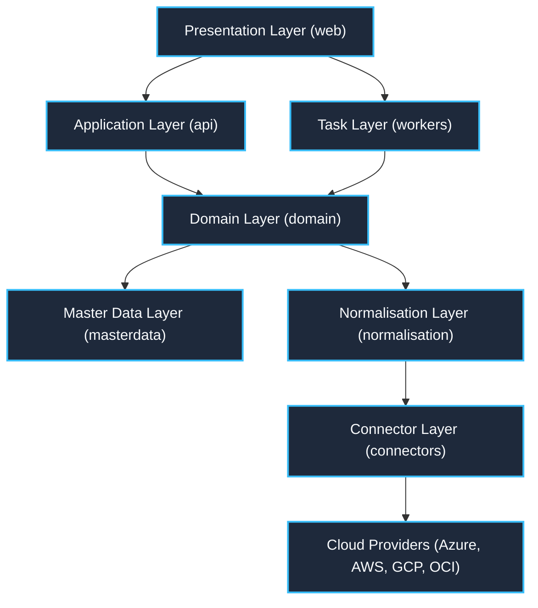

# CloudLens Architecture Overview

> **Version**: 1.0  
> **Source Baseline**: BBP Section 13 (Architecture Layers) & Section 42 (Technology Stack)  
> **Scope**: Microsoft Azure, Amazon Web Services, Google Cloud Platform, Oracle Cloud Infrastructure

---

## 1. Architectural Principles

CloudLens is a web-based, multi-cloud governance, service inventory, cloud pricing, cost management, runtime/usage monitoring, dependency mapping, budgeting, alerting and reporting application.

### Key Principles:
1. **Preserve Native Truth**: The platform faithfully discovers and preserves each provider's native organizational hierarchy (Azure Management Groups, AWS Organizations/OUs, GCP Folders/Projects, OCI Compartments) while offering a canonical abstraction for comparison.
2. **Strict Layering**: Inward dependency flow: `presentation` → `application` → `domain` → `normalisation` → `ingestion` → `connector` → `provider`.
3. **No Pricing Invention**: Absolute rule: pricing data is never hallucinated or estimated without empirical backing from provider APIs or official documentation.
4. **Read-Only MVP**: The platform operates with strictly read-only permissions across all connected cloud estates. Zero autonomous remediation or mutation in MVP.
5. **Open Source Core**: Built on Linux, Python 3.11, FastAPI, Pydantic, SQLAlchemy, PostgreSQL, Redis, Celery, React, and OpenTelemetry.

---

## 2. Monorepo Layer Structure

### Layer Responsibilities:
- **`web/`**: Modern React/TypeScript Single Page Application delivering 27 responsive screens, interactive dependency graphs, executive dashboards, and contextual explanation panels.
- **`api/`**: FastAPI REST API enforcing authentication, RBAC, scope authorization, query pagination, and sanitized standardized responses.
- **`workers/`**: Celery asynchronous task workers orchestrating discovery, metric ingestion, cost sync, threshold evaluation, and alert delivery.
- **`domain/`**: Canonical models and business rules, strictly provider-agnostic. Represents `Resource`, `Service`, `CostFact`, `Threshold`, `Budget`, `Alert`.
- **`masterdata/`**: First-class monorepo area (`AM-01`) holding all catalogues, registries, units, conversion factors, and reference taxonomies.
- **`normalisation/`**: Translation engines mapping provider-native types to FOCUS categories, executing unit conversions, and standardizing metadata.
- **`connectors/`**: Discrete provider packages implementing `BaseCloudConnector`. Responsible for API calls, pagination, rate limit retries, and data extraction.
- **`db/`**: Relational persistence (PostgreSQL 16) with range-partitioned period fact tables, row-level tenant security, and Alembic migrations.
- **`ops/`**: Docker Compose local developer stack, Kubernetes manifests, and deployment automation.
