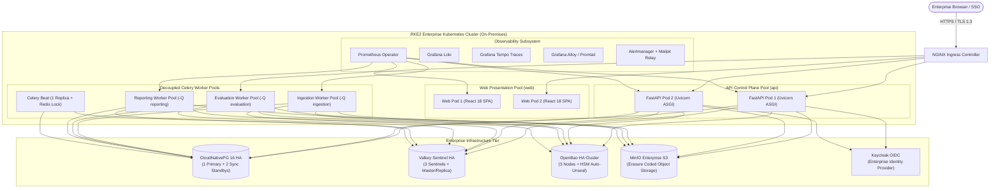

# CloudLens On-Premises Architecture & Low-Level Design (LLD)

> **Document Class**: Low-Level System Design (LLD) & Datacenter Architecture Specification  
> **Release Authority**: Enterprise Datacenter Deployment Guide (§1–§11)  
> **Target Environment**: Sovereign On-Premises Enterprise Datacenter (Air-Gapped RKE2 Kubernetes $\ge 1.28$)  
> **Status**: APPROVED FOR PRODUCTION RELEASE v1.1  

---

## 1. Executive Architecture Summary

CloudLens is deployed as an on-premises, air-gapped sovereign multi-cloud FinOps governance platform. It aggregates telemetry across **Amazon Web Services (AWS)**, **Microsoft Azure**, **Google Cloud Platform (GCP)**, and **Oracle Cloud Infrastructure (OCI)** via read-only APIs while running entirely within private enterprise infrastructure.

### 1.1 Non-Negotiable Datacenter Design Principles
1. **Zero Cloud Mutations**: Zero write, create, update, or mutate permissions exist on cloud credentials.
2. **Zero-Secret Values Files**: All Helm values contain strictly zero secrets; secrets are resolved at runtime from OpenBao.
3. **Pod Security Standards (Restricted Profile)**: Non-root execution (`UID 10001`), read-only root filesystems, drop `ALL` capabilities, and `seccompProfile: RuntimeDefault`.
4. **Isolated Workload Queues**: Ingestion, evaluation, and reporting workers run in decoupled pools.
5. **Deterministic Disaster Recovery**: 35-day Point-In-Time Recovery (PITR) via CloudNativePG continuous WAL streaming to MinIO.

---

## 2. On-Premises Production Deployment Topology


```mermaid
flowchart TD
    Client([Enterprise Browser / SSO]) -->|HTTPS / TLS 1.3| Ingress[NGINX Ingress Controller]
    
    subgraph RKE2_Cluster["RKE2 Enterprise Kubernetes Cluster (On-Premises)"]
        subgraph Web_Pool["Web Presentation Pool (web)"]
            Web1["Web Pod 1 (React 18 SPA)"]
            Web2["Web Pod 2 (React 18 SPA)"]
        end

        subgraph API_Pool["API Control Plane Pool (api)"]
            API1["FastAPI Pod 1 (Uvicorn ASGI)"]
            API2["FastAPI Pod 2 (Uvicorn ASGI)"]
        end

        subgraph Worker_Pools["Decoupled Celery Worker Pools"]
            W_Ingest["Ingestion Worker Pool (-Q ingestion)"]
            W_Eval["Evaluation Worker Pool (-Q evaluation)"]
            W_Report["Reporting Worker Pool (-Q reporting)"]
            Beat["Celery Beat (1 Replica + Redis Lock)"]
        end

        subgraph Monitoring_Stack["Observability Subsystem"]
            Prom["Prometheus Operator"]
            Loki["Grafana Loki"]
            Tempo["Grafana Tempo Traces"]
            Alloy["Grafana Alloy / Promtail"]
            AlertMgr["Alertmanager + Mailpit Relay"]
        end
    end

    subgraph Datacenter_Dependencies["Enterprise Infrastructure Tier"]
        CNPG[("CloudNativePG 16 HA\n(1 Primary + 2 Sync Standbys)")]
        Valkey[("Valkey Sentinel HA\n(3 Sentinels + Master/Replica)")]
        OpenBao[("OpenBao HA Cluster\n(3 Nodes + HSM Auto-Unseal)")]
        MinIO[("MinIO Enterprise S3\n(Erasure Coded Object Storage)")]
        IdP["Keycloak OIDC\n(Enterprise Identity Provider)"]
    end

    Ingress --> Web1 & Web2
    Ingress --> API1 & API2
    API1 & API2 --> CNPG & Valkey & OpenBao & MinIO & IdP
    W_Ingest & W_Eval & W_Report --> CNPG & Valkey & OpenBao & MinIO
    Beat --> Valkey & CNPG
    Prom --> API1 & API2 & W_Ingest & W_Eval & W_Report
```

---

## 3. High-Availability Infrastructure Matrix

| Subsystem | Technology Component | High Availability Architecture | Failover Mechanism | Backup / Recovery Protocol |
|:---|:---|:---|:---|:---|
| **Container Orchestration** | RKE2 (Rancher Kubernetes Engine) | 3 Control Plane nodes, N Worker nodes | Etcd Raft consensus, automated pod rescheduling | Velero daily backup (`840h` TTL) |
| **Relational Database** | CloudNativePG (PostgreSQL 16) | 3-instance quorum (1 Primary, 2 Sync Standbys) | Automated failover via CNPG operator ($\text{RTO} < 10\text{s}$, $\text{RPO} \approx 0$) | Barman continuous WAL streaming, 35-day PITR |
| **Secret Management** | OpenBao HA (`v1.16+`) | 3-node integrated Raft consensus cluster | Hardware Security Module (HSM) PKCS#11 auto-unseal | Daily automated Raft snapshot CronJob to MinIO |
| **Object Storage** | MinIO Enterprise | Distributed erasure-coded cluster across drives | Bitrot protection, continuous parity healing | Cross-site replication & versioning |
| **Cache & Task Broker** | Valkey Sentinel (`7.2+`) | 3 Sentinel processes + Primary/Replica pair | Automated Sentinel quorum failover ($< 5\text{s}$) | In-memory append-only file (AOF) persistence |
| **Identity & Access** | Keycloak OIDC (`24.0+`) | Multi-replica deployment with Infinispan caching | Active-active session replication behind Ingress | Realm exported configuration in Git |

---

## 4. Traffic Shifting: Weighted Canary Protocol

CloudLens uses **one traffic-shift method only: Weighted Canary** via NGINX Ingress Controller annotations. Dual-endpoint and blue-green DNS switches are strictly deprecated in favor of progressive in-cluster weight shifting.

```mermaid
flowchart LR
    Traffic([Enterprise User Requests]) --> Ingress[Ingress Controller]
    Ingress -->|Main Route (90% -> 50% -> 0%)| Stable["Stable API (v1.0.x)"]
    Ingress -->|Canary Route (10% -> 50% -> 100%)| Canary["Canary API (v1.1.x)"]
```

### 4.1 Progressive Ingress Weight Annotations
```bash
# 1. Route 10% of live traffic to canary
kubectl annotate ingress cloudlens-api-canary \
  nginx.ingress.kubernetes.io/canary="true" \
  nginx.ingress.kubernetes.io/canary-weight="10" --overwrite

# 2. Advance to 50% after 15 minutes of zero errors
kubectl annotate ingress cloudlens-api-canary \
  nginx.ingress.kubernetes.io/canary-weight="50" --overwrite

# 3. Promote to 100% primary traffic
kubectl patch deployment cloudlens-api --patch-file deploy-v1.1.yaml
kubectl annotate ingress cloudlens-api-canary \
  nginx.ingress.kubernetes.io/canary="false" --overwrite
```

---

## 5. Production Smoke Checks (Replacing Simulator 'Canary')

Synthetic simulator tests are forbidden as production deployment quality gates. Live deployments must pass **Production Smoke Checks** against live Kubernetes endpoints:

```bash
# Execute production smoke check against deployed cluster
python scripts/verify_release_readiness.py \
  --endpoint https://cloudlens.corp.internal \
  --role SUPER_ADMIN \
  --check-live-probes
```

Verification Protocol:
1. **Liveness & Readiness Probes**: HTTP 200 on `/api/v1/health` verifying database pool and Valkey connectivity.
2. **Control Tower 14 Panels**: Query `GET /api/v1/control-tower/overview`, confirming all 14 panels report `GREEN` or `AMBER` (zero `RED` tiles).
3. **OpenBao HSM Unseal**: Query `/api/v1/health/ready` confirming Vault secrets mount.
4. **MinIO Storage Probe**: Validate read/write access to `cloudlens-raw` and `cloudlens-parquet` buckets.
5. **Worker Queue Backlog**: Confirm zero message stalls across `ingestion`, `evaluation`, and `reporting`.

---

## 6. Zero-Trust Network Policy Architecture

Every pod in the `cloudlens` namespace operates under an explicit `default-deny` policy ([`ops/helm/cloudlens/templates/networkpolicy.yaml`](../ops/helm/cloudlens/templates/networkpolicy.yaml)):
1. **`default-deny`**: Disallows all inbound and outbound traffic by default.
2. **`allow-ingress`**: Permits Ingress controller $\to$ `web:3000` and `api:8000`.
3. **`allow-prometheus-scrape`**: Permits Prometheus operator $\to$ `api:8000` and `worker:9808`.
4. **`allow-dns-egress`**: Permits UDP/TCP 53 $\to$ CoreDNS.
5. **`allow-app-egress`**: Permits explicit TCP egress only to PostgreSQL (5432), Valkey (6379/26379), OpenBao (8200), MinIO (9000), Keycloak (8080/8443), SMTP (25/587/1025), and outbound Cloud APIs (443 HTTPS).

---

## 7. Production Go-Live Checklist (Guide §11)

All criteria must be evidenced prior to production cutover:

| Gate | Category | Verification Item | Status | Verification Method | Evidence Required |
|:---:|:---|:---|:---:|:---|:---|
| **G-01** | Architecture | RKE2 production cluster healthy with $\ge 3$ control plane nodes | [ ] | `kubectl get nodes` | Node status `Ready`, etcd quorum verified |
| **G-02** | Security | OpenBao HA cluster initialized and HSM auto-unseal verified | [ ] | `vault status` | Sealed: `false`, Storage Type: `raft`, HA Cluster active |
| **G-03** | Storage | MinIO distributed buckets created with encryption & lifecycle rules | [ ] | `mc admin info` | Buckets `cloudlens-raw`, `cloudlens-parquet`, `cloudlens-backups` |
| **G-04** | Database | CloudNativePG 3-instance cluster healthy with WAL continuous streaming | [ ] | `kubectl cnpg status` | Primary + 2 Standbys streaming, lag $< 100\text{ms}$ |
| **G-05** | Cache | Valkey Sentinel cluster healthy with 3-node quorum | [ ] | `redis-cli -p 26379 sentinel ckquorum` | OK 3 usable sentinels |
| **G-06** | Identity | Keycloak OIDC realm `cloudlens` configured with 9 enterprise roles | [ ] | OIDC Discovery probe | `/.well-known/openid-configuration` HTTP 200, role mapper active |
| **G-07** | Network | Zero-Trust NetworkPolicies active (default-deny enforced) | [ ] | `kubectl get netpol -n cloudlens` | 5 policies active; inter-pod rogue traffic blocked |
| **G-08** | Security | Non-root container execution & read-only root filesystems | [ ] | Kubeconform & Pod audit | SecurityContext `runAsNonRoot: true`, `readOnlyRootFilesystem: true` |
| **G-09** | Backup | CloudNativePG scheduled base backup & 35-day PITR verified | [ ] | `kubectl get scheduledbackup` | First base backup completed to MinIO with WAL archive |
| **G-10** | Backup | OpenBao Raft snapshot CronJob active | [ ] | `kubectl get cronjob backup-openbao-snapshot` | Scheduled daily at `02:00 UTC` with S3 target |
| **G-11** | Ingestion | Disconnected worker pools (ingestion, evaluation, reporting) healthy | [ ] | Celery inspect probe | All 3 queues active, zero cross-worker queue contention |
| **G-12** | Telemetry | Prometheus ServiceMonitors collecting 18 mandatory metric families | [ ] | Prometheus API query | `up{namespace="cloudlens"} == 1` across all components |
| **G-13** | Alerting | Alertmanager webhook active with Mailpit/Postfix relay and Watchdog heartbeat | [ ] | Alertmanager API probe | Dead-man's Watchdog alert active, zero dropped notifications |
| **G-14** | Control Tower | Control Tower overview accessible to `admin@jyotirmoyb.com` with 14 panels green | [ ] | `GET /api/v1/control-tower/overview` | HTTP 200, 14 panels green/amber, zero red status |
| **G-15** | Performance | Ingestion throughput $\ge 10,000$ rows / 60s benchmarked | [ ] | Performance load test | p95 API response $< 500\text{ms}$, ingestion memory leak 0 MB |
| **G-16** | Upgrade | Weighted canary ingress configured and rollback verified | [ ] | Ingress canary test | Canary weight 0% -> 10% -> 50% -> 100% test executed cleanly |
| **G-17** | Sign-Off | Factory Acceptance Test (FAT) passed with zero unverified regressions | [ ] | [`fat/test_summary.md`](../fat/test_summary.md) | 350 passed, 0 failed, 76 BBP acceptance criteria verified |
