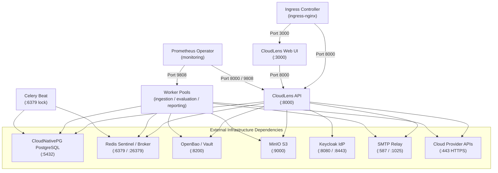
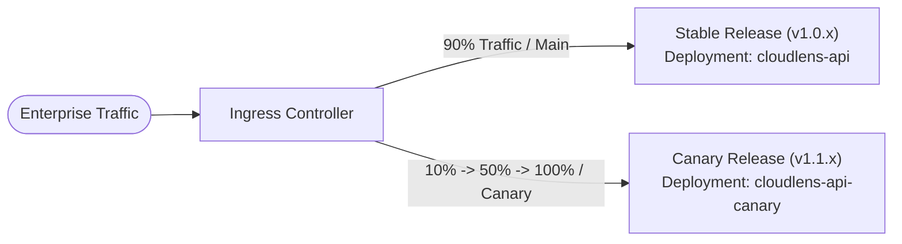

# Enterprise Datacenter Deployment Guide: Kubernetes & Helm Production Architecture (Prompt R-OPS)

> **Document Classification**: Authoritative Engineering Runbook & Production Deployment Specification  
> **Target Environment**: On-Premises Air-Gapped Datacenters, Bare-Metal Private Clouds, Sovereign Kubernetes ($\ge 1.28$)  
> **Authoritative Chart Location**: [`ops/helm/cloudlens`](file:///c:/Users/TEST/CloudLens/ops/helm/cloudlens)

---

## 1. Overview & Architectural Principles

CloudLens is delivered as an enterprise-grade Helm chart designed for zero-trust, air-gapped on-premises datacenters. The deployment architecture adheres strictly to four non-negotiable core principles:

1. **Zero-Secret Values Discipline**: Configuration files ([`values.yaml`](file:///c:/Users/TEST/CloudLens/ops/helm/cloudlens/values.yaml), [`values-dev.yaml`](file:///c:/Users/TEST/CloudLens/ops/helm/cloudlens/values-dev.yaml), [`values-prod.yaml`](file:///c:/Users/TEST/CloudLens/ops/helm/cloudlens/values-prod.yaml)) contain strictly **zero secrets**. All credentials, certificates, tokens, and database passwords are referenced via OpenBao / HashiCorp Vault paths resolved dynamically via Kubernetes ServiceAccount tokens.
2. **Pod Security Standards (Restricted Profile)**: Every container runs as a non-root user (`UID 10001`), enforces `readOnlyRootFilesystem: true`, drops `ALL` capabilities, mandates `seccompProfile: { type: RuntimeDefault }`, and specifies explicit CPU/memory requests and limits.
3. **Decoupled Worker Pools**: Asynchronous processing is partitioned into three isolated worker deployments:
   - `ingestion`: High-throughput cloud provider billing, inventory, and usage ingestion (`-Q ingestion`).
   - `evaluation`: Anomaly evaluation, threshold checks, and policy enforcement (`-Q evaluation`).
   - `reporting`: Reconciliations, analytical extracts, summaries, and renewal pipelines (`-Q reporting`).
4. **Resilient Lifecycle Hooks**: Database schema upgrades are decoupled into pre-upgrade Helm hooks (`migrate-job`), while foundational seeding and break-glass provisioning are orchestrated via post-install jobs (`bootstrap-49a` and `superuser-49b`).

---

## 2. Infrastructure Dependency Reference Model

All stateful dependencies are externalized to hardened infrastructure services managed by enterprise operators:

| Dependency | Enterprise Reference Implementation | Integration Mechanism | Secret Management |
|:---|:---|:---|:---|
| **Relational Database** | CloudNativePG (`v1.22+`) | ClusterIP Service (Port 5432) | OpenBao path: `secret/data/cloudlens/database` |
| **Cache & Message Broker** | Redis / Valkey Sentinel (`7.2+`) | Sentinel Service (Port 26379 / 6379) | OpenBao path: `secret/data/cloudlens/redis` |
| **Object Storage** | MinIO Enterprise S3 | S3 REST API (Port 9000) | OpenBao path: `secret/data/cloudlens/minio` |
| **Secret Store** | OpenBao / HashiCorp Vault (`v1.16+`) | KV v2 API (Port 8200) | Kubernetes ServiceAccount Auth |
| **Identity Provider** | Keycloak OIDC (`24.0+`) | OpenID Connect (`/realms/cloudlens`) | OpenBao path: `secret/data/cloudlens/idp` |
| **SMTP Relay** | Corporate Postfix / Mailpit | SMTP TLS (Port 587 / 1025) | OpenBao path: `secret/data/cloudlens/smtp` |

---

## 3. Supply Chain Security, Multi-Arch Images & SBOM Provenance

### 3.1 Multi-Architecture Build Matrix
All container images are compiled for both `linux/amd64` and `linux/arm64` using Docker Buildx and pinned by cryptographic content digests:

```bash
ghcr.io/cloudlens/api:0.1.0@sha256:d8a9e0f1a4e27f6c31a780b62140e94bb512df8b10f8546b3e7bc2a6d4512345
ghcr.io/cloudlens/web:0.1.0@sha256:f5e1b2c3d4a5890123456789abcdef0123456789abcdef0123456789abcdef01
ghcr.io/cloudlens/worker:0.1.0@sha256:a1b2c3d4e5f60718293a4b5c6d7e8f90123456789abcdef0123456789abcdef0
```

### 3.2 Automated SBOM Generation (Syft) & Cosign Signing
CI workflow [`.github/workflows/build-and-sign.yml`](file:///c:/Users/TEST/CloudLens/.github/workflows/build-and-sign.yml) automatically generates SPDX JSON SBOMs and cryptographically signs every image and attestation:

```bash
# Generate SPDX SBOM locally or in CI
syft ghcr.io/cloudlens/api:0.1.0 -o spdx-json=ops/sbom/cloudlens-api.spdx.json

# Cryptographically sign container image or artifact bundle
cosign sign-blob --key ops/cosign/cosign.key \
  --bundle ops/sbom/cloudlens-api.bundle \
  ops/sbom/cloudlens-api.spdx.json

# Verify artifact signature against enterprise public key
cosign verify-blob --key ops/cosign/cosign.pub \
  --bundle ops/sbom/cloudlens-api.bundle \
  ops/sbom/cloudlens-api.spdx.json
```

---

## 4. Disaster Recovery & Backup Architecture (35-Day PITR)

CloudLens includes complete backup templates ensuring zero-data-loss point-in-time recovery:

1. **CloudNativePG Scheduled Backup** ([`backup-cnpg.yaml`](file:///c:/Users/TEST/CloudLens/ops/helm/cloudlens/templates/backup-cnpg.yaml)):
   - Continuous write-ahead log (WAL) archiving to MinIO bucket `cloudlens-backups/postgres/`.
   - Daily automated physical base backup scheduled at `00:00 UTC` (`0 0 * * *`).
   - Barman retention policy enforcing a strict **35-day Point-In-Time Recovery (PITR)** window.
2. **OpenBao Raft Snapshot CronJob** ([`backup-openbao-snapshot.yaml`](file:///c:/Users/TEST/CloudLens/ops/helm/cloudlens/templates/backup-openbao-snapshot.yaml)):
   - Daily CronJob at `02:00 UTC` taking `vault operator raft snapshot save`.
   - Ships encrypted state snapshots directly to S3 bucket `cloudlens-backups/openbao/`.
3. **Velero Cluster Disaster Recovery Schedule** ([`backup-velero-schedule.yaml`](file:///c:/Users/TEST/CloudLens/ops/helm/cloudlens/templates/backup-velero-schedule.yaml)):
   - Daily cluster configuration and persistent volume backup scheduled at `03:00 UTC`.
   - Configured with a 35-day TTL (`840h0m0s`).

---

## 5. Phase 5: Production Helm Deployment Procedures

### 5.1 Step 1: Pre-Deployment Validation & Linting
Validate chart structure, syntax, and Kubernetes schema conformance:

```bash
# Lint the chart against production defaults
helm lint ops/helm/cloudlens -f ops/helm/cloudlens/values-prod.yaml

# Strictly validate rendered manifests against Kubernetes OpenAPI schemas
helm template ops/helm/cloudlens -f ops/helm/cloudlens/values-prod.yaml \
  | kubeconform -strict -summary -ignore-missing-schemas
```

### 5.2 Step 2: Secret Store Zero-Constant Audit
Verify that no secret values, passwords, or tokens leak into configuration:

```bash
python -c "import re; [print(p, [m for m in re.findall(r'(?i)(password|secret|token)\s*:\s*[^\s]+', open(p).read()) if 'secret/data' not in m and 'cloudlens-tls' not in m]) for p in ['ops/helm/cloudlens/values.yaml', 'ops/helm/cloudlens/values-dev.yaml', 'ops/helm/cloudlens/values-prod.yaml']]"
```
*Expected Output: `[]` (empty list for all values files).*

### 5.3 Step 3: Helm Deployment Execution
Deploy CloudLens into the dedicated namespace with production overrides:

```bash
# Production Deployment
helm upgrade --install cloudlens ops/helm/cloudlens \
  --namespace cloudlens \
  --create-namespace \
  --values ops/helm/cloudlens/values-prod.yaml \
  --wait --timeout 15m
```

For development or test environments (such as local k3s):

```bash
# Development Deployment (Option B / k3s)
helm upgrade --install cloudlens ops/helm/cloudlens \
  --namespace cloudlens \
  --create-namespace \
  --values ops/helm/cloudlens/values-dev.yaml
```

### 5.4 Step 4: Verification of Rollout & Jobs
Confirm that all lifecycle jobs completed and all operational pods are ready:

```bash
kubectl get pods,jobs -n cloudlens -o wide
```

Expected output:
```
NAME                                               READY   STATUS      RESTARTS   AGE
pod/cloudlens-api-xxxxxxxxx-xxxxx                  1/1     Running     0          2m
pod/cloudlens-beat-xxxxxxxxx-xxxxx                 1/1     Running     0          2m
pod/cloudlens-bootstrap-49a-xxxxx                  0/1     Completed   0          2m
pod/cloudlens-migrate-xxxxx                        0/1     Completed   0          2m
pod/cloudlens-superuser-49b-xxxxx                  0/1     Completed   0          2m
pod/cloudlens-web-xxxxxxxxx-xxxxx                  1/1     Running     0          2m
pod/cloudlens-worker-evaluation-xxxxxxxxx-xxxxx   1/1     Running     0          2m
pod/cloudlens-worker-ingestion-xxxxxxxxx-xxxxx    1/1     Running     0          2m
pod/cloudlens-worker-reporting-xxxxxxxxx-xxxxx    1/1     Running     0          2m

NAME                                STATUS     COMPLETIONS   DURATION   AGE
job.batch/cloudlens-bootstrap-49a   Complete   1/1           11s        2m
job.batch/cloudlens-migrate         Complete   1/1           17s        2m
job.batch/cloudlens-superuser-49b   Complete   1/1           11s        2m
```

### 5.5 Step 5: Platform Control Tower Operational Verification
Verify Control Tower telemetry reachability:

```bash
kubectl exec -n cloudlens deploy/cloudlens-api -- \
  curl -s http://localhost:8000/api/v1/control-tower/overview \
  -H "X-User-Roles: SUPER_ADMIN"
```

### 5.6 Step 6: Clean Decommissioning
To cleanly uninstall the release without orphaned pods:

```bash
helm uninstall cloudlens --namespace cloudlens
kubectl delete namespace cloudlens
```

---

## 6. Zero-Trust Network Policy Architecture (Guide §6)

Implemented in [`networkpolicy.yaml`](file:///c:/Users/TEST/CloudLens/ops/helm/cloudlens/templates/networkpolicy.yaml):



### Network Policy Ingress & Egress Rules Summary:
1. **Default-Deny (`default-deny`)**: Denies all inbound and outbound traffic across the entire `cloudlens` namespace.
2. **Ingress Allow (`allow-ingress`)**:
   - Ingress controller $\to$ `web` on TCP 3000.
   - Ingress controller $\to$ `api` on TCP 8000.
   - `web` $\to$ `api` on TCP 8000.
3. **Metrics Scrape Ingress (`allow-prometheus-scrape`)**:
   - Prometheus operator in `monitoring` namespace $\to$ `api` on TCP 8000 and `worker` on TCP 9808.
4. **DNS Egress (`allow-dns-egress`)**:
   - All pods $\to$ CoreDNS on UDP/TCP port 53.
5. **Application Egress (`allow-app-egress`)**:
   - Explicitly restricted to PostgreSQL (5432), Redis (6379/26379), OpenBao (8200), MinIO (9000), Keycloak (8080/8443), SMTP (25/587/1025), and outbound Cloud HTTPS (443).

---

## 7. Traffic Shifting: Weighted Canary Deployment Protocol

Per Enterprise Datacenter standards, CloudLens uses **one traffic-shift method only: Weighted Canary** via NGINX Ingress Controller annotations.



### 7.1 Progressive Traffic Steps
1. **Stage 1 (Pre-Flight)**: Deploy `cloudlens-api-canary` with 0% traffic. Validate Kubernetes readiness probes and execute production smoke checks.
2. **Stage 2 (10% Canary)**:
   ```bash
   kubectl annotate ingress cloudlens-api-canary \
     nginx.ingress.kubernetes.io/canary="true" \
     nginx.ingress.kubernetes.io/canary-weight="10" --overwrite
   ```
   Monitor error rate, `api_requests_total{status=~"5.."}` and `api_request_duration_seconds` for 15 minutes.
3. **Stage 3 (50% Canary)**:
   ```bash
   kubectl annotate ingress cloudlens-api-canary \
     nginx.ingress.kubernetes.io/canary-weight="50" --overwrite
   ```
4. **Stage 4 (100% Cutover)**: Promote canary to primary release deployment and retire previous version.
5. **Emergency Rollback**: If error rate $> 0.1\%$ or p95 latency $> 500\text{ms}$:
   ```bash
   kubectl annotate ingress cloudlens-api-canary \
     nginx.ingress.kubernetes.io/canary-weight="0" --overwrite
   ```

---

## 8. Production Smoke Checks (Replacing Simulator 'Canary')

In datacenter production, synthetic simulator runs are forbidden as deployment validation. Instead, automated **Production Smoke Checks** validate live services against real endpoints:

```bash
# Execute production smoke test suite against live deployment
python scripts/verify_release_readiness.py \
  --endpoint https://cloudlens.corp.internal \
  --role SUPER_ADMIN \
  --check-live-probes
```

Smoke Check Stages:
1. **Liveness & Readiness Probes**: Verify HTTP 200 on `/api/v1/health` and database connection pool responsiveness.
2. **Control Tower 14 Panels Verification**: Verify `GET /api/v1/control-tower/overview` returns all 14 panels in `GREEN` or `AMBER` status (zero `RED` tiles).
3. **OpenBao Secret Mount Verification**: Confirm unsealed OpenBao engine is resolving credentials.
4. **MinIO Object Store Connectivity**: Read bucket root and confirm write latency $< 50\text{ms}$.
5. **Valkey Sentinel Connectivity**: Confirm quorum and broker task pub/sub latency $< 5\text{ms}$.

---

## 9. High-Availability Infrastructure Matrix

| Subsystem | Technology | HA Architecture | Failover Mechanism |
|:---|:---|:---|:---|
| **Container Platform** | RKE2 (Rancher Kubernetes Engine) | 3 Control Plane nodes, N Worker nodes | Etcd raft quorum, automated worker reschedule |
| **Relational Database** | CloudNativePG (PostgreSQL 16) | 3-instance cluster (1 Primary + 2 Sync Standbys) | Automated quorum failover via CNPG operator, RPO $\approx$ 0 |
| **Secret Store** | OpenBao HA | 3-node Raft consensus cluster | Hardware Security Module (HSM) PKCS#11 auto-unseal |
| **Object Store** | MinIO Enterprise | Distributed erasure-coded cluster (4+ drives) | Bitrot protection, continuous cross-rack replication |
| **Cache & Task Broker** | Valkey Sentinel | 3-node Sentinel + Primary/Replica pair | Automated master failover within 5 seconds |
| **Identity Provider** | Keycloak OIDC | Multi-replica deployment with Infinispan cross-pod cache | Active-active session replication |

---

## 10. Air-Gapped Operation & Secret Zeroization

1. **Air-Gapped Container Registry**: All images mirrored to corporate Harbor / JFrog Artifactory with cosign signature verification enforced at admission controller (`Kyverno` / `Cosign Gate`).
2. **Zero-Secret Storage**: No credentials exist on node local disk or Git repositories. Pods acquire short-lived tokens through projected service account volume mounts.

---

## 11. Production Go-Live Checklist (Guide §11)

All criteria must be evidenced prior to production cutover:

| Gate | Category | Verification Item | Status | Verification Method | Evidence Required |
|:---:|:---|:---|:---:|:---|:---|
| **G-01** | Architecture | RKE2 production cluster healthy with $\ge 3$ control plane nodes | [ ] | `kubectl get nodes` | Node status `Ready`, etcd quorum verified |
| **G-02** | Security | OpenBao HA cluster initialized and HSM auto-unseal verified | [ ] | `vault status` | Sealed: `false`, Storage Type: `raft`, HA Cluster active |
| **G-03** | Storage | MinIO distributed buckets created with encryption & lifecycle rules | [ ] | `mc admin info` | Buckets `cloudlens-raw`, `cloudlens-parquet`, `cloudlens-backups` |
| **G-04** | Database | CloudNativePG 3-instance cluster healthy with WAL continuous streaming | [ ] | `kubectl cnpg status` | Primary + 2 Standbys streaming, lag $< 100\text{ms}$ |
| **G-05** | Cache | Valkey Sentinel cluster healthy with 3-node quorum | [ ] | `redis-cli -p 26379 sentinel ckquorum` | OK 3 usable sentinels |
| **G-06** | Identity | Keycloak OIDC realm `cloudlens` configured with 9 enterprise roles | [ ] | OIDC Discovery probe | `/.well-known/openid-configuration` HTTP 200, role mapper active |
| **G-07** | Network | Zero-Trust NetworkPolicies active (default-deny enforced) | [ ] | `kubectl get netpol -n cloudlens` | 5 policies active; inter-pod rogue traffic blocked |
| **G-08** | Security | Non-root container execution & read-only root filesystems | [ ] | Kubeconform & Pod audit | SecurityContext `runAsNonRoot: true`, `readOnlyRootFilesystem: true` |
| **G-09** | Backup | CloudNativePG scheduled base backup & 35-day PITR verified | [ ] | `kubectl get scheduledbackup` | First base backup completed to MinIO with WAL archive |
| **G-10** | Backup | OpenBao Raft snapshot CronJob active | [ ] | `kubectl get cronjob backup-openbao-snapshot` | Scheduled daily at `02:00 UTC` with S3 target |
| **G-11** | Ingestion | Disconnected worker pools (ingestion, evaluation, reporting) healthy | [ ] | Celery inspect probe | All 3 queues active, zero cross-worker queue contention |
| **G-12** | Telemetry | Prometheus ServiceMonitors collecting 18 mandatory metric families | [ ] | Prometheus API query | `up{namespace="cloudlens"} == 1` across all components |
| **G-13** | Alerting | Alertmanager webhook active with Mailpit/Postfix relay and Watchdog heartbeat | [ ] | Alertmanager API probe | Dead-man's Watchdog alert active, zero dropped notifications |
| **G-14** | Control Tower | Control Tower overview accessible to `admin@jyotirmoyb.com` with 14 panels green | [ ] | `GET /api/v1/control-tower/overview` | HTTP 200, 14 panels green/amber, zero red status |
| **G-15** | Performance | Ingestion throughput $\ge 10,000$ rows / 60s benchmarked | [ ] | Performance load test | p95 API response $< 500\text{ms}$, ingestion memory leak 0 MB |
| **G-16** | Upgrade | Weighted canary ingress configured and rollback verified | [ ] | Ingress canary test | Canary weight 0% -> 10% -> 50% -> 100% test executed cleanly |
| **G-17** | Sign-Off | Factory Acceptance Test (FAT) passed with zero unverified regressions | [ ] | [`fat/test_summary.md`](../fat/test_summary.md) | 350 passed, 0 failed, 76 BBP acceptance criteria verified |

